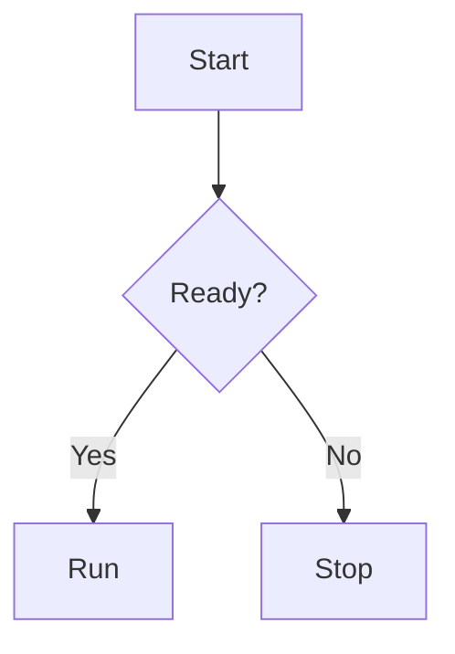
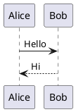

# md2pdf Diagram Renderer

`mermaid`, `plantuml`, `ascii` fenced code block이 포함된 Markdown 파일을 고품질 PDF로 렌더링하는 Python CLI입니다. 한글 타이포그래피를 기본 지원하며, 다이어그램이 없는 문서는 Java/Node.js 없이도 변환할 수 있습니다.

## Features

- 단일 Markdown → 단일 PDF 변환
- 다이어그램 블록 지원
  - ```` ```mermaid ```` — Flowchart, Sequence, Class, State, ER, Gantt, Pie, Gitgraph
  - ```` ```plantuml ```` — Sequence, Class, Activity, Component, State, Object, Use Case
  - ```` ```ascii ```` — 그대로 monospace 렌더링
- **Lazy 의존성 체크** — 문서에 포함된 다이어그램 종류만 검사
  - Mermaid 블록 없으면 → Node.js/npx 불필요
  - PlantUML 블록 없으면 → Java/plantuml.jar 불필요
  - 다이어그램 없는 순수 Markdown → Playwright만 필요
- 한글 최적화 CSS (Apple SD Gothic Neo, Noto Sans KR, D2Coding)
- GitHub 스타일 테이블 (zebra striping, header 배경색)
- Blockquote 파란 accent, 코드 블록 syntax 스타일링
- `page-break-inside: avoid` (테이블, 코드 블록, 다이어그램)
- **전역 설치** — `uv tool install`로 어디서든 `md2pdf` 실행 가능
- `-o` 생략 시 입력 파일과 같은 위치에 `.pdf` 자동 생성

## Architecture

```
Markdown ──▶ Parser ──▶ Diagram Renderer ──▶ HTML Builder ──▶ PDF Renderer
               │              │                    │               │
          markdown-it    mermaid-cli (npx)      Jinja2        Playwright
                         plantuml.jar (java)                  Chromium
                         ascii (HTML escape)
```

**렌더링 파이프라인:**

1. `parser.py` — markdown-it-py로 토큰화, 다이어그램 블록을 placeholder로 치환
2. `diagram_renderers.py` — 각 다이어그램을 SVG로 렌더링 (Mermaid: npx CLI, PlantUML: java -jar pipe, ASCII: HTML escape)
3. `html_builder.py` — Jinja2 템플릿 + CSS로 HTML 문서 조립, placeholder를 SVG `<figure>`로 교체
4. `pdf_renderer.py` — Playwright Chromium headless로 HTML → PDF 변환

## Requirements

| 도구 | 필요 조건 | 설치 확인 |
|------|----------|----------|
| Python 3.10+ | 항상 | `python3 --version` |
| uv | 설치 및 프로젝트 관리 | `uv --version` |
| Playwright Chromium | 항상 | `playwright install chromium` |
| Node.js 18+ / npx | Mermaid 블록 있을 때 | `node --version` |
| Java 17+ | PlantUML 블록 있을 때 | `java --version` |
| PlantUML JAR | PlantUML 블록 있을 때 | `md2pdf-bootstrap` |

## Install

```bash
# 전역 설치 (어디서든 md2pdf 실행 가능)
uv tool install /path/to/md2pdf-diagram-renderer

# Playwright 브라우저 설치
playwright install chromium

# (PlantUML 사용 시) JAR 다운로드 → ~/.local/share/md2pdf/plantuml.jar
md2pdf-bootstrap
```

설치 후 `md2pdf`, `md2pdf-bootstrap` 두 개의 CLI가 PATH에 추가됩니다.

### 개발 환경

```bash
# 프로젝트 클론 후 의존성 설치
uv sync --extra dev

# 로컬 개발 실행
uv run md2pdf input.md -o output.pdf
```

## CLI

```bash
md2pdf <input.md> [-o <output.pdf>] [options]
```

### Options

| 옵션 | 기본값 | 설명 |
|------|--------|------|
| `-o, --output` | `<input>.pdf` | 출력 PDF 경로 (생략 시 입력 파일 옆에 생성) |
| `--page-size` | `Letter` | PDF 페이지 크기 (`Letter`, `A4`) |
| `--margin-top` | `0.5in` | 상단 여백 (in, cm, mm, px) |
| `--margin-right` | `0.5in` | 우측 여백 |
| `--margin-bottom` | `0.5in` | 하단 여백 |
| `--margin-left` | `0.5in` | 좌측 여백 |
| `--timeout-seconds` | `60` | 다이어그램별 타임아웃 (초) |
| `--keep-temp` | off | 임시 렌더링 아티팩트 보존 |
| `--verbose` | off | 디버그 로깅 활성화 |

### Examples

```bash
# 기본 변환 (output: ./input.pdf)
md2pdf input.md

# A4 + 커스텀 여백
md2pdf report.md -o report.pdf --page-size A4 --margin-top 1cm --margin-bottom 1cm

# 다이어그램이 없는 문서 (Node.js/Java 불필요)
md2pdf notes.md -o notes.pdf

# 디버그 모드
md2pdf complex.md -o complex.pdf --verbose --keep-temp
```

## Example Markdown

````markdown
# Diagram Demo

일반 텍스트와 다이어그램을 혼합한 예시입니다.





```ascii
+--------+
|  API   |
+---+----+
    |
+---v----+
| Worker |
+--------+
```
````

## Project Structure

```
md2pdf-diagram-renderer/
├── src/md2pdf_cli/
│   ├── __init__.py            # Public API: render_markdown_to_pdf()
│   ├── _paths.py              # 패키지 기준 경로 해석
│   ├── _bootstrap.py          # PlantUML JAR 다운로드 (md2pdf-bootstrap)
│   ├── cli.py                 # Typer CLI 엔트리포인트
│   ├── config.py              # RenderConfig / RenderResult dataclass
│   ├── diagram_renderers.py   # Mermaid, PlantUML, ASCII 렌더링
│   ├── errors.py              # 예외 계층 + exit code
│   ├── html_builder.py        # Jinja2 HTML 문서 조립
│   ├── logging_utils.py       # 로깅 설정
│   ├── parser.py              # Markdown 파싱 + 다이어그램 추출
│   ├── pdf_renderer.py        # Playwright PDF 생성
│   ├── assets/
│   │   └── default.css        # 한글 타이포그래피 CSS (wheel에 번들)
│   └── templates/
│       └── base.html          # Jinja2 HTML 템플릿 (wheel에 번들)
├── scripts/
│   └── bootstrap_tools.py     # PlantUML JAR 다운로드 (레거시)
├── tests/
│   ├── integration/           # 통합 테스트 (외부 도구 필요)
│   ├── test_cli.py
│   ├── test_dependencies.py
│   ├── test_diagram_renderers.py
│   ├── test_errors.py
│   ├── test_html_builder.py
│   ├── test_parser.py
│   └── test_paths.py
├── pyproject.toml             # hatchling 빌드 + 프로젝트 설정
├── uv.lock                    # 재현 가능한 의존성 lock
└── .python-version            # Python 3.14
```

### 데이터 저장 위치

| 항목 | 경로 |
|------|------|
| PlantUML JAR | `~/.local/share/md2pdf/plantuml.jar` |
| CSS/템플릿 | 패키지 내부 (wheel에 번들) |

## Error Codes

| 코드 | 의미 | 일반적 원인 |
|------|------|------------|
| `0` | 성공 | — |
| `2` | 의존성 오류 | node/npx/java/playwright/plantuml.jar 미설치 |
| `3` | 다이어그램 렌더링 오류 | Mermaid/PlantUML 문법 오류 |
| `4` | 입력/파싱 오류 | 파일 없음, UTF-8 아님, 마크다운 파싱 실패 |
| `5` | PDF 렌더링 오류 | Playwright/Chromium 장애 |

## Troubleshooting

### `plantuml.jar not found` (exit code 2)

```bash
md2pdf-bootstrap
```

### `Playwright Chromium is not available` (exit code 2)

```bash
playwright install chromium
```

### Mermaid 렌더링 실패 (exit code 3)

- Mermaid 문법을 [mermaid.live](https://mermaid.live)에서 먼저 검증
- Node.js 18+ 설치 확인: `node --version`

### PlantUML 렌더링 실패 (exit code 3)

- PlantUML 문법을 [plantuml.com](https://www.plantuml.com/plantuml)에서 검증
- Java 17+ 설치 확인: `java --version`

### 한글이 깨지는 경우

CSS가 시스템 폰트를 사용합니다:
- macOS: Apple SD Gothic Neo (기본 내장)
- Linux/Windows: [Noto Sans KR](https://fonts.google.com/noto/specimen/Noto+Sans+KR) 설치 필요

## Tests

```bash
# 단위 테스트 (외부 도구 불필요)
uv run pytest

# 통합 테스트 (Node.js, Java, Playwright 필요)
RUN_MD2PDF_INTEGRATION=1 uv run pytest -m integration

# 전체 + verbose
RUN_MD2PDF_INTEGRATION=1 uv run pytest -v
```

## Library Usage

CLI 외에 Python 라이브러리로도 사용할 수 있습니다:

```python
from pathlib import Path
from md2pdf_cli import RenderConfig, render_markdown_to_pdf

result = render_markdown_to_pdf(
    input_path=Path("input.md"),
    output_path=Path("output.pdf"),
    config=RenderConfig(page_size="A4"),
)
print(f"렌더링 완료: {result.output_path} ({result.rendered_diagram_count}개 다이어그램, {result.elapsed_ms}ms)")
```