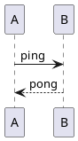

# Mixed Diagrams


```mermaid
graph TD
  A --> B
```


```plantuml
@startuml
A -> B: ping
B --> A: pong
@enduml
```

```ascii
+---------+
| Gateway |
+----+----+
     |
+----v----+
| Worker  |
+---------+
```
